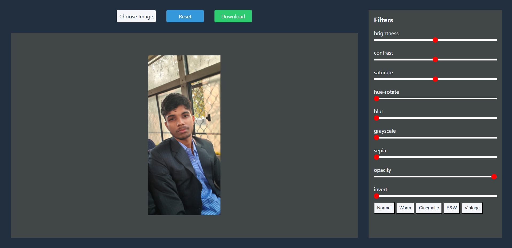
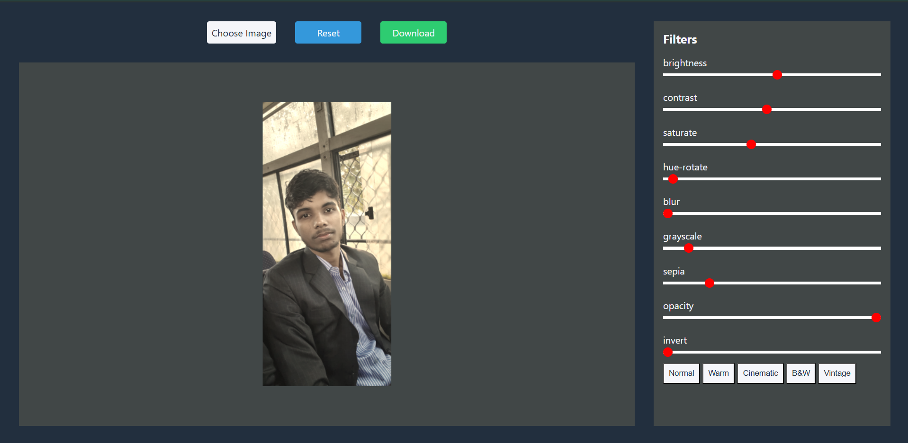
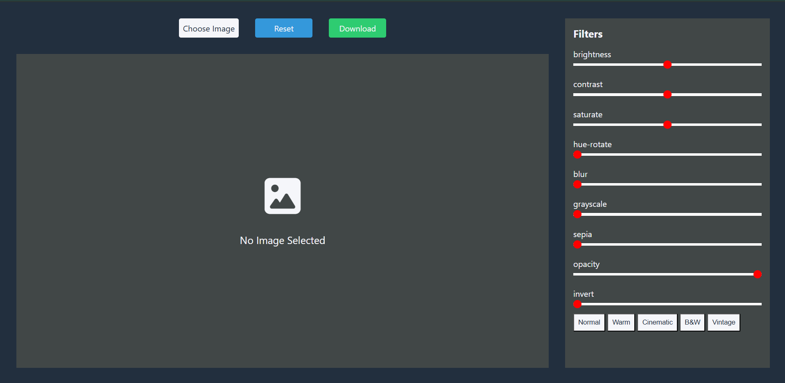

# Image Editor

A browser-based image editor built with HTML, CSS, vanilla JavaScript, and the Canvas API. Users can upload an image, apply adjustable filters, use preset looks, reset edits, and download the edited result as a PNG.

## Live Link

    https://vishalloop.github.io/JavaScript-playground/Image_Editor/

## Preview





## Features

- Image upload through a file input.
- Canvas-based image rendering.
- Automatic image scaling to fit the canvas while preserving aspect ratio.
- Adjustable filter sliders.
- Preset filter styles.
- Reset button to restore default filter values.
- Download button that exports the edited canvas as `edited-image.png`.
- Font Awesome icons for the empty image state.
- Separate `theme.css` file for design tokens.

## Available Filters

| Filter | Default | Range | Unit |
| --- | --- | --- | --- |
| Brightness | 100 | 0-200 | `%` |
| Contrast | 100 | 0-200 | `%` |
| Saturate | 100 | 0-200 | `%` |
| Hue Rotate | 0 | 0-200 | `deg` |
| Blur | 0 | 0-20 | `px` |
| Grayscale | 0 | 0-200 | `%` |
| Sepia | 0 | 0-200 | `%` |
| Opacity | 100 | 0-100 | `%` |
| Invert | 0 | 0-200 | `%` |

## Presets

The editor includes five preset looks:

- Normal
- Warm
- Cinematic
- B&W
- Vintage

When a preset is selected, JavaScript updates both the internal filter values and the visible slider positions, then redraws the image on the canvas.

## How It Works

The uploaded image is loaded through `URL.createObjectURL`. Once the image finishes loading, the canvas is set to `800 x 480`, the active CSS filter string is assigned to the canvas context, and the image is drawn with aspect-ratio-safe scaling.

The filter string is built dynamically from the `filters` object:

```js
brightness(100%) contrast(100%) saturate(100%) ...
```

Each slider updates its matching filter value, applies the new filter string, and redraws the canvas. The download button converts the canvas to a PNG data URL and triggers a browser download.

## Files

```text
Project4_Image_Editor/
+-- index.html
+-- style.css
+-- theme.css
+-- script.js
+-- screenshots/
```

## How To Run

Open `index.html` in a browser, choose an image, adjust filters, and click `Download`.

## Possible Improvements

- Add crop, rotate, flip, and resize tools.
- Add before/after preview toggle.
- Add undo and redo history.
- Add active styling for the selected preset.
- Add drag-and-drop image upload.
- Add responsive layout for smaller screens.
- Add numeric value labels beside each slider.
- Add export quality or format options such as JPG and WebP.
