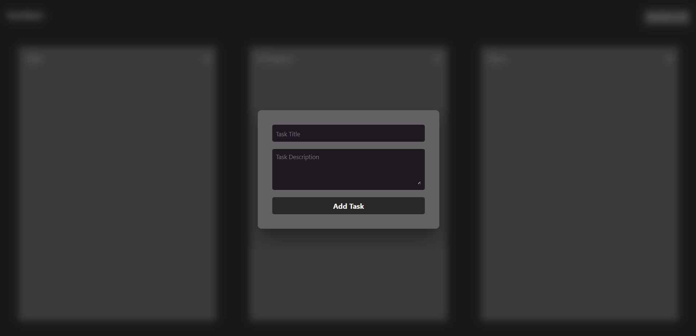
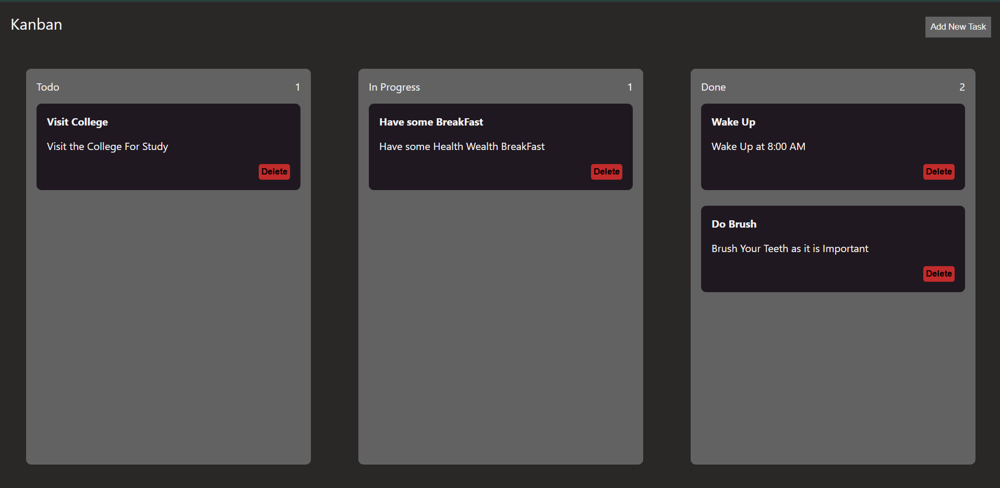
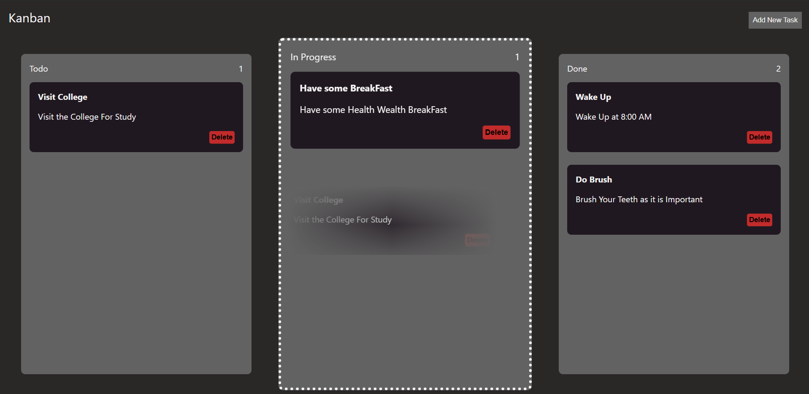

# Kanban Board

A simple Kanban task board built with HTML, CSS, and vanilla JavaScript. It lets users create tasks, move them between workflow columns with drag-and-drop, delete tasks, and keep the board saved in the browser.

## Live Link

    https://vishalloop.github.io/JavaScript-playground/Kanban_Board/

## Preview





## Features

- Three workflow columns: Todo, In Progress, and Done.
- Add-task modal with title and description fields.
- Dynamically created task cards.
- Native HTML drag-and-drop support.
- Drop-zone highlighting while dragging over a column.
- Live task counts for every column.
- Delete button for each task.
- Persistent board state using `localStorage`.
- Modal overlay with blurred background.

## How It Works

Tasks are created with the `createTask` function. Each task becomes a draggable `.task` element containing:

- Task title.
- Task description.
- Delete button.

When dragging starts, the current task is stored in `droppedElement`. Each column listens for `dragover`, `dragenter`, `dragleave`, and `drop` events. On drop, the selected task is appended to the target column's `.tasks` container.

After adding, moving, or deleting a task, the board:

1. Updates column counts.
2. Saves all tasks back to `localStorage`.

## Local Storage

The board saves tasks under this key:

```text
kanbanTasks
```

Each saved task includes:

```js
{
  title: "Task title",
  detail: "Task description",
  column: "todo | progress | done"
}
```

When the page loads, saved tasks are recreated and placed back into their previous columns.

## Files

```text
Project3_Kanban_Board/
+-- index.html
+-- style.css
+-- script.js
+-- Desktop_1.png
+-- Desktop_2.png
+-- Desktop_3.png
```

## How To Run

Open `index.html` in a browser.

## Possible Improvements

- Add edit support for existing tasks.
- Add task priority, labels, or due dates.
- Add keyboard-accessible task movement controls.
- Add a confirmation dialog before deleting tasks.
- Add responsive mobile layout where columns stack vertically.
- Add separate `screenshots/` folder for consistency with the other projects.
- Add drag handles so users know exactly where to grab a card.
- Add empty-state messages for each column.
