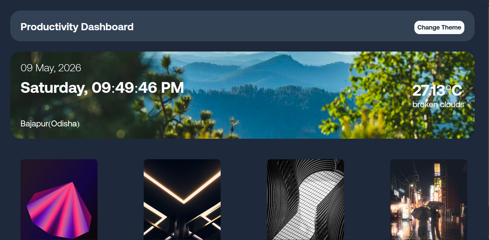
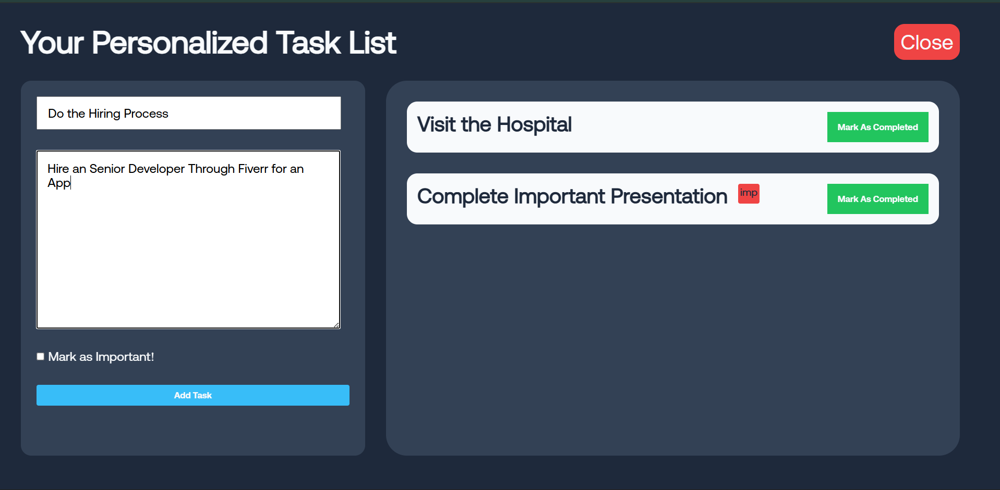
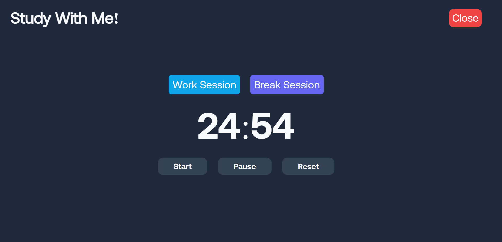

# Productivity Dashboard

A personal productivity dashboard built with HTML, CSS, and vanilla JavaScript. It combines several daily-use tools into one interface: tasks, day planning, motivation, Pomodoro focus sessions, weather, time, and theme switching.

## Live Link

    https://vishalloop.github.io/JavaScript-playground/Productivity_Dashboard/


## Preview





## Features

- Dashboard home screen with four main tools.
- To-do list with task title, task details, and important-task marker.
- Task completion flow that removes completed tasks.
- Daily planner with hourly input slots from 6:00 to 24:00.
- Planner entries saved in `localStorage`.
- Motivation section that fetches a random quote.
- Pomodoro timer with work and break sessions.
- Start, pause, and reset controls for the timer.
- Weather panel using browser geolocation.
- Reverse geocoding to show the user's city and state.
- OpenWeather API integration for temperature and condition.
- Live date and time display.
- Theme switcher with six color palettes.
- Custom local font files for a stronger visual identity.

## Dashboard Sections

### To Do List

The to-do section lets users create tasks with a title and optional details. A checkbox marks a task as important, which adds an `imp` badge in the rendered task card.

Tasks are saved to:

```text
localStorage key: allTask
```

### Daily Planner

The planner creates 18 hourly blocks dynamically, starting from 6:00 and ending at 24:00. Each input saves automatically when edited.

Planner data is saved to:

```text
localStorage key: plannerData
```

### Motivation

The quote section fetches a random quote from:

```text
https://dummyjson.com/quotes/random
```

It displays the quote text and author inside a styled motivation card.

### Pomodoro Timer

The Pomodoro tool supports two modes:

| Mode | Duration |
| --- | --- |
| Work Session | 25 minutes |
| Break Session | 5 minutes |

Users can start, pause, reset, and switch between work and break modes.

### Weather

The weather section asks for location permission through the browser. It uses latitude and longitude to fetch:

- City and state from Nominatim reverse geocoding.
- Temperature and weather condition from OpenWeather.

## Theme System

The project uses CSS custom properties for colors. JavaScript cycles through six predefined themes and stores the selected theme index in:

```text
localStorage key: themeValue
```

## Files

```text
Project2_Productivity_Dashboard/
+-- index.html
+-- style.css
+-- script.js
+-- quote.png
+-- AeonikTRIAL-Bold.otf
+-- AeonikTRIAL-Light.otf
+-- AeonikTRIAL-Regular.otf
+-- screenshots/
```

## How To Run

Open `index.html` in a browser.

Because this project uses geolocation and remote APIs, a local server is recommended:

```bash
npx serve .
```

Then open the local URL in the browser and allow location access when prompted.

## Possible Improvements

- Hide or replace the public OpenWeather API key before publishing.
- Add error states for denied geolocation, failed weather requests, and offline mode.
- Add edit support for to-do tasks instead of only completion/removal.
- Add active styling for the selected Pomodoro mode.
- Add mobile responsive layouts for the cards and detail views.
- Add a settings panel for custom Pomodoro durations.
- Add drag-and-drop ordering for tasks.
- Add a more semantic title in `index.html` instead of `Document`.
