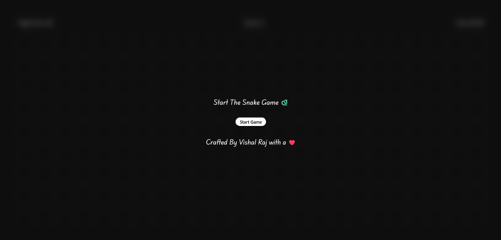
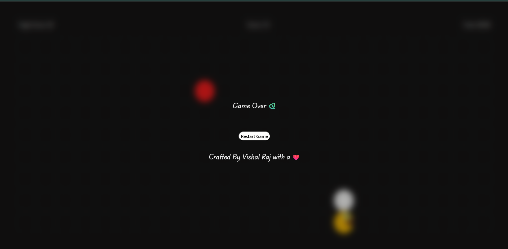
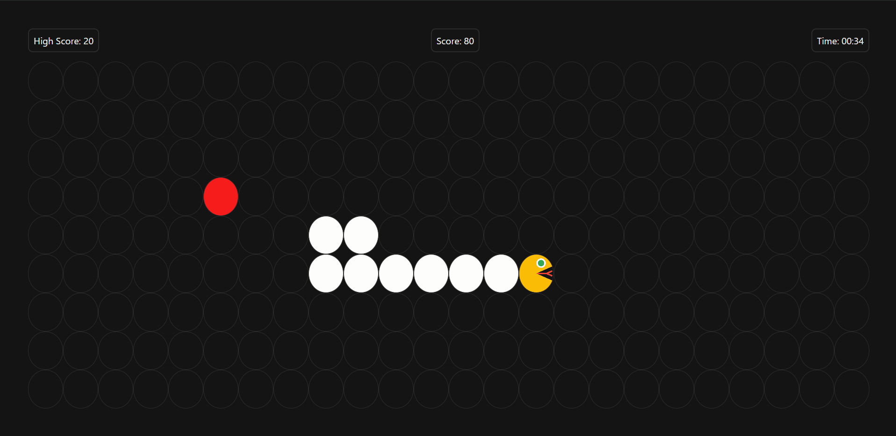
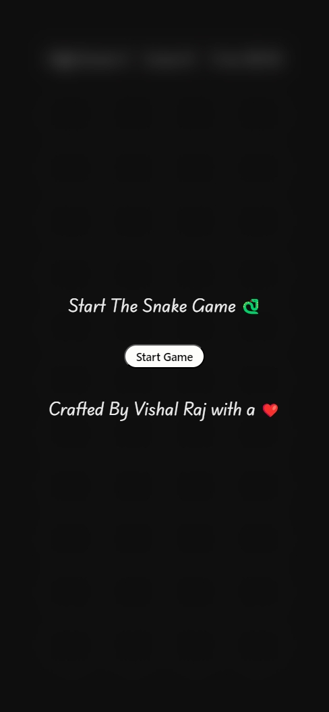
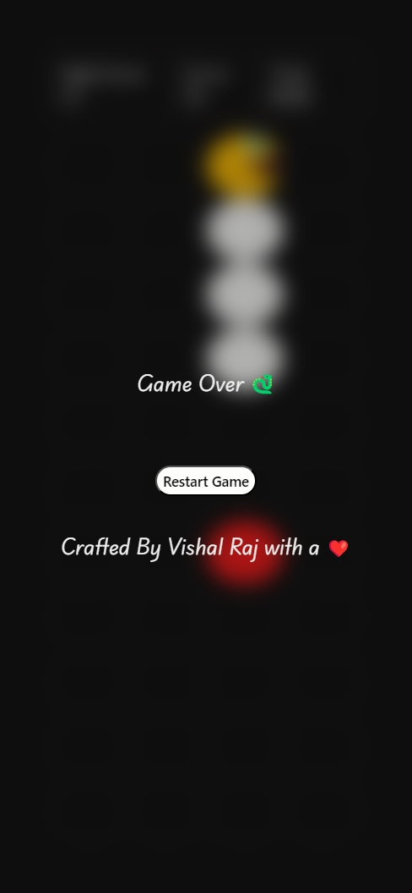
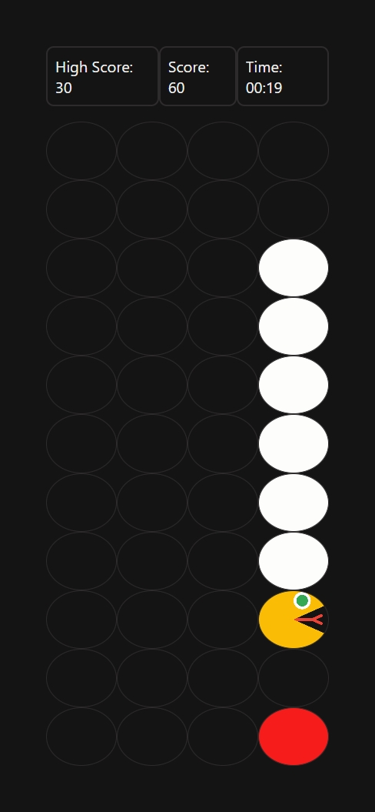

# Snake Game

A classic Snake game built with HTML, CSS, and vanilla JavaScript. The player controls a snake on a grid, collects food to grow and increase the score, and tries to avoid hitting the wall or the snake's own body.

## Preview

### Desktop





### Mobile





## Features

- Start screen modal before gameplay begins.
- Restart flow after game over.
- Live score counter that increases when food is eaten.
- Persistent high score using `localStorage`.
- Timer that tracks how long the current run lasts.
- Keyboard controls with arrow keys.
- Grid-based snake movement.
- Food generation at random grid positions.
- Wall collision detection.
- Self-collision detection.
- Custom snake head image using `snake-head.png`.

## How It Works

The game board is created dynamically in JavaScript. The script measures the `.game-box` size, calculates how many 60px rows and columns fit inside it, and then creates a grid of `.box` elements.

The snake is stored as an array of coordinate objects:

```js
[{ x: 0, y: 0 }]
```

On every game tick, the script calculates a new head position based on the current direction. If the new head reaches food, the snake grows and the score increases. If not, the tail is removed, which creates the illusion of movement.

The game loop runs with `setInterval`, while a separate interval updates the timer. When the snake hits a wall or itself, both intervals are stopped and the game-over modal is displayed.

## Controls

| Key | Action |
| --- | --- |
| Arrow Up | Move up |
| Arrow Down | Move down |
| Arrow Left | Move left |
| Arrow Right | Move right |

The game prevents direct reversal, so the snake cannot immediately turn from up to down, left to right, or the opposite.

## Local Storage

The project stores the best score under this key:

```text
HighScore
```

This means the high score remains available after refreshing or reopening the page in the same browser.

## Files

```text
Project1_Snake_Game/
+-- index.html
+-- style.css
+-- script.js
+-- snake-head.png
+-- screenshots/
```

## How To Run

Open `index.html` in a browser.

## Possible Improvements

- Add touch controls or swipe support for mobile gameplay.
- Add difficulty levels with different snake speeds.
- Add pause and resume controls.
- Add sound effects for eating food and game over.
- Prevent food from spawning inside the snake body.
- Add responsive grid sizing so the game feels smoother on small screens.
